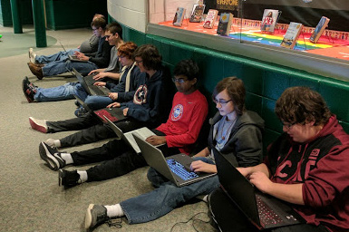
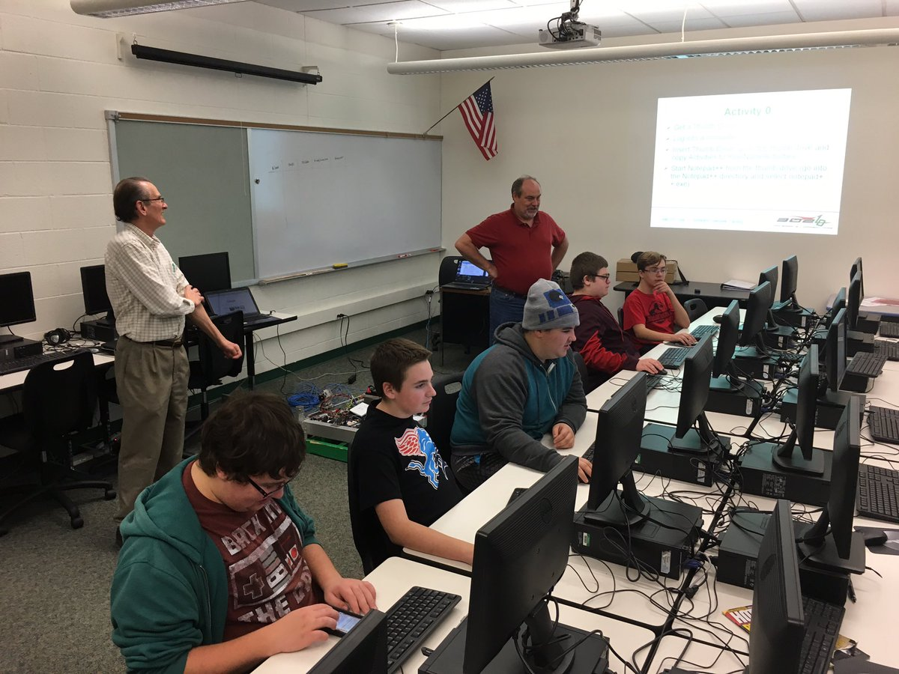

=================
Coding Languages
=================

.. _installation:

RoboRio Robot Code
====================

C++
----

This is the main language we use on competition robots.

Self-paced Tutorials:
~~~~~~~~~~~~~~~~~~~~~

-    `Learncpp tutorial  <https://www.learncpp.com/>`_
-    `W3Schools C++ tutorial <https://www.w3schools.com/cpp/default.asp>`_

Training Presentations:
~~~~~~~~~~~~~~~~~~~~~

-     `C++ Basics (summer 2023):  <https://docs.google.com/presentation/d/1PeexmqShnf3PD-yPm97TZl94VXbjihP0/edit?usp=sharing&ouid=108257398000499150515&rtpof=true&sd=true>`_  Generic C++ using online compiler

-    `C++ Programming I (2017): <https://docs.google.com/presentation/d/1K56woxaXvloTdD96qgGN816_1pcUihMs8mL8JUr8M4Y/edit#slide=id.g1f87997393_0_782>`_   Robot-based examples for basic C++ concepts (need a chassis bot to complete activities)

-    `C++ Programming II (2017): <https://docs.google.com/presentation/d/1bt-19HIg4407cSDP2U8ghxULp6YjhSRs7ZiG9XLmSW8/edit?pli=1#slide=id.g1f87997393_0_782>`_   Object Oriented and C++ 11/14 concepts (need a chassis bot to complete activities)

-    `Year 1 training 2022:  <https://docs.google.com/presentation/d/13W5solJC5CxRrpFzc1F39aa1BfkAEQIf/edit?usp=sharing&ouid=108257398000499150515&rtpof=true&sd=true>`_ requires chassis bot to complete activities

XML / DTD / XSD
----------------

Our Robot Configuration Files are defined in XML.  The Code Generator utilizes XSD to generate the XML files.

Self-paced Training:
~~~~~~~~~~~~~~~~~~~~~

-    `W3Schools XML Tutorial <https://www.w3schools.com/xml/default.asp>`_

Training Presentations:
~~~~~~~~~~~~~~~~~~~~~

-    `Introduction to XML (2017): <https://docs.google.com/presentation/d/1oUOGqBp5AHyon0QSj0bG_IrJghgE0Y1lq85PgYP48Mw/edit#slide=id.g1f87997393_0_782>`_  covers XML, DTD and Robot.xml parsing concepts.

Code Generator Code 
===================

C#
----

Our Code Generator is written in C#.  

Self-paced Tutorials:
~~~~~~~~~~~~~~~~~~~~~

-    `W3Schools C# tutorial  <https://www.w3schools.com/cs/index.php>`_

Training Presentations:
~~~~~~~~~~~~~~~~~~~~~

-   `C# programming from 2017 <https://docs.google.com/presentation/d/149Tu9QUNAZ9sPf6bedXer4GpiOl1lxSqK600yxFeNK0/edit#slide=id.g3ca070eb69_0_62>`_  General with Hero board-based demonstration robot activities

Co-Processor
=============

Besides the things shown here, the C++ options from RoboRio Robot Code can also apply.

Python
-------

Sometimes we do our vision coding in Python on the co-processor.

Self-Paced Training
~~~~~~~~~~~~~~~~~~~~~

-    `W3Schools Python tutorial <https://www.w3schools.com/python/default.asp>`_

TODO:  add more details

OpenCV
--------

TODO: add details

GRIP
----

TODO:  add details

TensorFlow
-----------

TODO:  add details

Hero Board Demo Robots
======================

There is a Connect 4 Robot and the T-Shirt Shooter that use a Hero Board.

See Code Generator C# for details.
