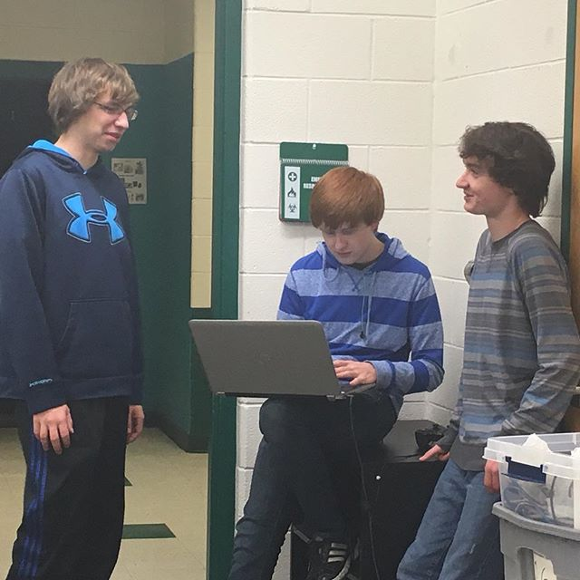
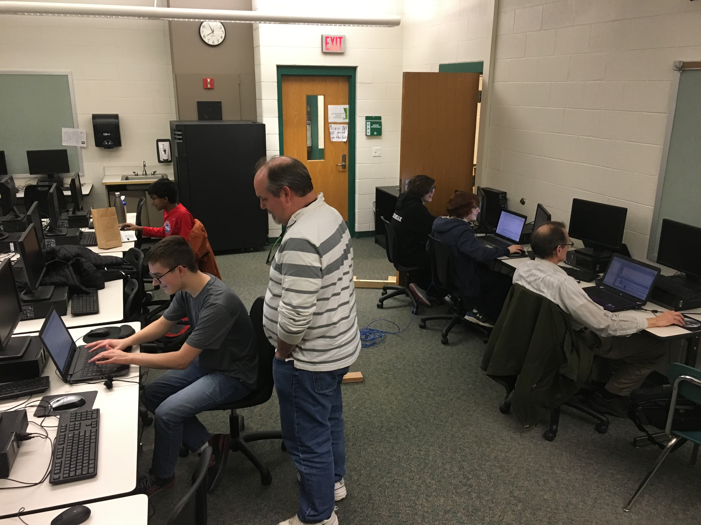

===================================
Development Enviornment
===================================

Initial Environment Setup (WPILib + VS Code)
====================================

To set up the environment, first follow the instructions from https://docs.wpilib.org/en/stable/docs/zero-to-robot/step-2/index.html for the C++ or common tasks.  Pay attention to how to install third party apps.  This will give access to things we use such as:

* WPILIB-New-Commands (used by chassis and vision)

* CTRE-Phoenix (v5) older hardware

* CTRE-Phoenix (v6) newer hardware

* CTRE-Phoenix Replay (v6)

* Elastic (dashboard)

* Choreo (autonomous path generation)

* Glass (dashboard)

* AdvantageScope (log viewer)

Visual Studio Code 
--------

Visual Studio Code (VSCode) is a free development environment that is best supported by WPILib.  It is different from Microsoft's other development environment, Visual Studio, in many ways.  However, we do use Visual Studio to develop our code generator.  VS Code comes bundled with WPILib's install so there is no need to install separately.  It also comes with the WPILib extension, which offers lots of functionality to build and deploy robot code, simulate robot code, and more.  

We have been using Github Copilot as well inconjunction with VSCode to develop the software.

VS Code Intellisense Issue
^^^^^^^^^^^^^^^^
Occasionally intellisense (the service that provides code completion, error highlighting, and more) will suddenly stop working in VS Code.  If this happens, take the steps below to fix the issue.

  This is from this Chief Delphi topic https://www.chiefdelphi.com/t/intelli-non-sense-help/375155/3

It’s actually not a Gradle issue, it’s just that occasionally the vscode engine gets confused. Follow the following steps to try and reset everything.

* Make sure you’re not getting any popups saying you’re in the wrong folder when opening vscode, or any other popups.

* Make sure you didn’t accidentally create a c_cpp_properties.json file in the .vscode folder. It breaks everything. If it’s there, delete it.

* Close all files in vscode. Leave vscode open.

* Run the refresh c++ intellisense command in vscode.

* Once that finishes, in the bottom right you should see something that looks like a platform (linuxathena or windowsx86-64 etc). If it’s not linuxathena click it and set it to one of the linuxathena one.

* Wait one minute (yes one whole minute don’t skip this)

* Open your main cpp file (not a header file). Intellisense should now be working.

* Not closing vscode while doing this is key, closing it will reset the process. You just have to close all the tabs.

Gradle
--------

Gradle is the code building tool that is bundled with WPILib to build and deploy our code to the robot.  It manages all of the different dependencies we have for third party libraries and works with a compiler to get our code to run on the robot.

There are two important files associated with Gradle. ``build.gradle`` is used to define all of our dependencies and it tells the compiler which files to compile.  We have edited this slightly to give us more details like the author of the build, date and time, etc.  The other file ``settings.gradle`` is used to set up some properties for GradleRIO, WPILib's Gradle extension.

3rd Party Tools
----------------

3rd Party tools (CTRE and REV are the ones we use)  See https://team302doco.readthedocs.io/en/latest/hardware.html#ctre-pheonix-tuner and https://team302doco.readthedocs.io/en/latest/hardware.html#rev-hardware-client for details on running the tools.

In addition to the WPILib/FIRST provided tools, we use other 3rd party tools to develop, test, and run our robot code.  These include:

* `Cross The Road Electronics Phoenix Pro Library <https://pro.docs.ctr-electronics.com/en/stable/>`_ - an API to control the Falcon 500 motors we mainly use and read data from our sensors like CANCoders and the Pigeon IMU.  
* `Cross The Road Electronics Phoenix Tuner X <https://pro.docs.ctr-electronics.com/en/stable/docs/tuner/index.html>`_ - a tool to test and configure CTRE products (Falcon motors, CANCoders, CANivores, etc.).  Find more details on the tool `here <https://team302doco.readthedocs.io/en/latest/hardware.html#ctre-phoenix-tuner>`_
* `REV Hardware Client <https://docs.revrobotics.com/rev-hardware-client/>`_ - a tool to configure and read data from REV Robotics hardware (PDH, PCM, etc.).  Find more details on the tool `here <https://team302doco.readthedocs.io/en/latest/hardware.html#rev-hardware-client>`_
* `Filezilla <https://filezilla-project.org/>`_ - a tool to transfer files from our computers to the RoboRIO. (link to filezilla)

Software Configuration Management Tools
============================================

GitHub / Github Desktop 
--------------------------

GitHub is a website where our code is stored using a tool called Git.  Additionally, we manage our tasks and ToDo's using a Kanban board.  
-Our main GitHub page can be found at: https://github.com/orgs/Team302/repositories.
GitHub Desktop is a desktop program that interacts with GitHub to make it easier to commit code changes.  This is the most commonly used tool to manage our commits and changes locally. 
-It can be found here: https://desktop.github.com/.

VS Code Plugin
---------------

Here are some of the common commands we use from the WPILib VS Code Extension:

* Build Robot Code - This command is used to compile our robot code without deploying to the robot.  This is useful if you don't want to or aren't able to deploy to a robot but would like to be ready for when you can.
* Deploy Robot Code - This will build the robot code if it hasn't been built and then deploy the code to the robot.  This is how we test robot code and push our changes to be used on the field.
* Set Team Number - This sets the team number that you will deploy to with the previous command.  This needs to be set when switching from one robot to another.

.. note:: In the future, we may also create our own vs code extension to add convenient features like pulling up the docs locally and starting the code generator from vs code.

NI Game Tools - Driver's Station
===================================

The Driver's station comes with this installation as well as the networking capablities to use the USB A to USB B cord (more affectionately known as the BAH-BAH cord) to interact with the RoboRio.

Radio
===================================

Radio Configuration Tools (see https://team302doco.readthedocs.io/en/latest/hardware.html#radio-configuration-tool for details on running the tool)

TODO:  Add Details

Rev Hardware
===================================
Similar to Phenoix Tuner, Rev Hardware is used for configuring Rev motors.
-downlaod at (https://docs.revrobotics.com/rev-hardware-client/) and click instalation along the left side

Phoenix Tuner X
===================================
different from original phenox tuner, Pheonix Tuner X is the updated, better version, but serves the same function as Pheonix tuner: configuring motors.

-Find Pheonix Tuner X on the microsoft store and downlaod/update

Balena Etcher
===================================
Not absolutely neccesary on every laptop, but should be added. Belena etcher is used to flash sd cards (including those for the RoboRio), USb drives, limelights, and more.

find Balena at (https://etcher.balena.io) and download.

PathPlanner
===================================
instead of using PathWeaver, which is installed with WPILib, We install PathPlanner becuase of it's faster speed and easier use.

-Find PathPlanner in the microsoft store and download/update
