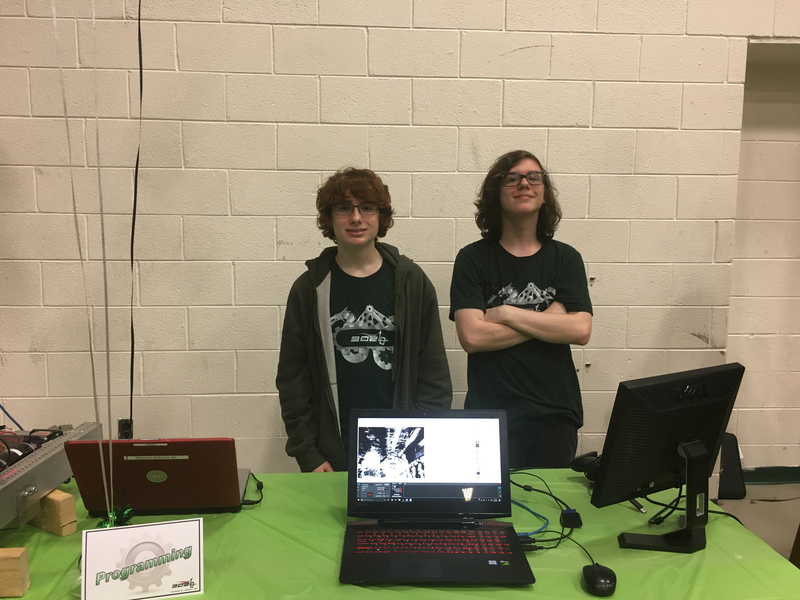

=========================
Plotting/Graphing
=========================

Third Coast Tools
=========================

Stryke Force has provided tools for getting telemetry data a plotting it.  The TCT (https://github.com/strykeforce/thirdcoast-tct) and the Grapher (https://github.com/strykeforce/grapher) applications.  The materials and videos for tuning motor PIDS using these tools can be found at:  https://www.strykeforce.org/resources/ in the Stryke Force Talon SRX Motor Training Course.

WPI Tools (glass, shuffleboard)
=========================

TODO:  pull doco
  
CTRE Tools
=========================

TODO: pull doco

Rev Tools
=========================

TODO:  pull doco

