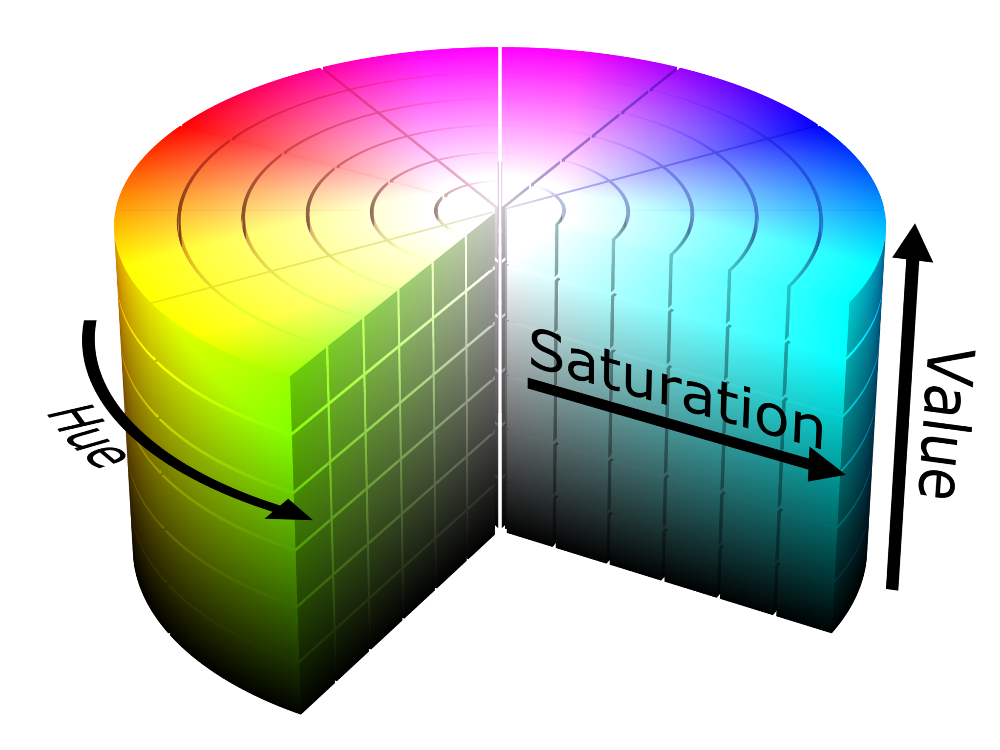

=========================
Vision / Machine Learning
=========================

Documentation
========================
The official `Limelight Documentation <https://docs.limelightvision.io/docs/docs-limelight/getting-started/summary/>`_ and `PhotonVision Documentation <https://docs.photonvision.org/en/latest/>`_ have more detailed steps and will be referenced throughout.

Terms
=========================

* Limelight: All-in-one system used to get vision up and going quickly and with little code.  Utilizes NetworkTables to trasnmit vision data.  Has easy to use web dashboard.

* PhotonVision: "One half" of Limelight, just has the web-dashboard and supports various hardware (Raspberry Pi, Orange Pi, Limelight, etc.)

* Hue, Saturation, and Value (HSV): A color model more commonly used for vision applications than RGB.  It represents the below color wheel.

* Hue: The color, or rotation around the model.  It ranges from 0 - 360 degrees.

* Saturation: The amount of gray in a color, from 0 - 100% (Can also appear from 0 - 1 where 0 is gray and 1 is the primary color).

* Value/Brightness: Works with saturation and describes the brightness/intensity of a color.  Expressed from 0 - 100%, where 0 is completely black, and 100 is the brightest.

* Color Thresholding: Creates a binary (black and white) image based on if pixels in image fit within a specified range of Hue, Saturation, and Value.
  -Simple to set up but can vary greatly between competitions and even different matches due to dependency on lighting conditions.

Vision Use Cases
=========================
* Aiming a shooter or rotating robot based on horizontal or vertical offset from an image (uses april tags).
* Rotating/ to a target (game piece, field element, etc.) by calculating distance with AprilTag data or using area on screen with math to guess based on distances previously tested (uses AprilTags, Machine Learning, or color thresholding).
* Detecting robots or game pieces (Machine Learning, color thresholding).
* Many more I can't think of

Target Types
=========================

AprilTags
---------
AprilTags look like QR-Codes spread across the field.  
Each AprilTag is unique with its own ID which can be used to determine field position.  
Detection algorithms give us 2D and 3D information about the AprilTag to get an accurate robot position.  
We can get the robot position relative to the AprilTag or relative to the field depending on if the tool we are using supports it or we do it ourselves in our code.  
AprilTags come in "families" which specify the encoding used to create the image.  
Currently for the 2024 season, FRC is using the `36h11 family <https://firstfrc.blob.core.windows.net/frc2024/FieldAssets/Apriltag_Images_and_User_Guide.pdf>`_.
For more information, see the AprilTag specfic sections for `Limelight <limelight:AprilTags>`_ and `PhotonVision <photonvision:AprilTags>`_.

Game Piece / Field Element Detection
--------------------------------------
Game Piece and Field Element detection can be done simply with HSV thresholding or with Machine Learning (PhotonVision currently doesn't support Machine Learning, would have to use another solution on a Pi or use Limelight).
FRC game pieces are commonly monochrome so HSV thresholding is a quick way to get detection up and running.
This can give us x and y offsets in the form of pixels.  
Camera characterization and collecting data based on distance can give us a distance measurement as well.
Machine Learning is a "smarter" way of detecting game pieces that can give more data and be more specific about detections.
ML can classify objects with more than just color and allow us to do more based on what specific type of object is detected.

Software Solutions on Co-Processor
======================================

PhotonVision
-------------
.. note::   This needs a co-processor (raspberry/orange pi) or runs on a LimeLight 2

Similar functionality to Limelight, still communicates over NetworkTables and supports different pipelines (hsv thresholding and AprilTags).
Needs some additional setup to image a co-processor, not plug-and-play like Limelight.

OpenCV
--------
.. note::   This needs a co-processor (or technically can run on the RoboRio but don't) blah
OpenCV is a library used for all sorts of various 

GRIP
-------

TODO:  pull doco
This needs a co-processor (or technically can run on the RoboRio but don't).

TensorFlow
-----------

TODO:  pull doco
This needs a co-processor.

AXON / Amazon Web Services
---------------------------

TODO: pull doco 

Combined Hardware/Software Solutions
=====================================

Limelight (can leverage Google Coral) 
----------------------------------------

  TODO: pull doco

Pixy cam
----------

TODO: pull doco

JeVois 
-------------

TODO: pull doco
